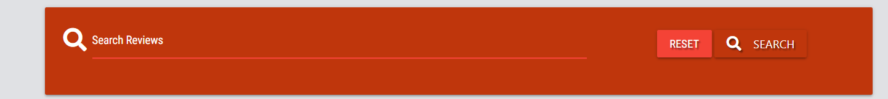
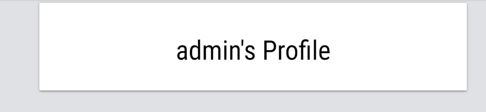

<h1 align="center">Welcome to Lock & Load Reviews</h1>

# About

### Lock & Load is a games review website, that allows users to review new and old games, and display them on a common platform.
### Users can use this platform safely for expressing their opinions on certain types of games or even for suggesting games to other users that might be interested on a new game of a determined genre.

# User Experience (UX)

# Strategy

## User Stories 

### Reasons as to why a user would visit this website

 * They are gamers or interested in games
 * Have an interest in being involved with the gaming community
 * Have an interest in making their opinions about a particular game known to other fellow gamers
 * The users are curious about a particular game and are searching for more opinions before purchasing the product

 ### Reasons for this website 
 
 * Provide information about a variety of games
 * Offer a chance for the gaming community to get together and make their voices heard with their opinions
 * to give a valuable advice on whether a game is worth the player's time and money 
 
 # Scope 

 ### What a user can expect

 * Meaningful content
 * A clean and aestethically pleasing website 
 * Easy to navigate
 * Helpful content 
 * Easy to navigate search bar
 * A good user system
 * A powerful database
 * Sense of community and interaction with like minded peers
 * Valuable opinions about different console games

 ### What a user may be seeking

 * More information about Games or a Game in particular
 * Voice their like or dislike about a certain game or games 
 * Valuable articles regarding games and console products
 * Share a new aquired knowledge about a game or games

 ### What I look for as a developer / business

 * Provide a useful and informative website
 * A way to connect the gaming community
 * To provide a way for users to be able to get more involved 
 * To be able to have a good amount of users loging into the database
 * To provide product information by users experiences while playing

 # Structure

 ### This website is made up of 4 pages
 * The homepage which consists of: 
   * A navbar with 7 Menu options:
        * 3 options only visible by not registered or logged out users
        * 4 options currently logged in users
        * 5 options for Admin only
   * The Accordion review display menu
   * A search bar that allows the users to search for specific genres or game titles, within the database
   * When logged in, users have additional buttons next to their posted review, which allows them to either Edit or Delete their review
   * The footer with copyright information and links to the gaming official websites

 * The New Review page which consists of:
   * A form with 4 required fields and a submit button:
        * Game Genre selection
        * Blank space for inserting the name of the game
        * Text Area where the user is able to write the review
        * Calendar with date selection for the review post date
        * A clean and simple layout

 * The New Genres (Admin only) page which consists of: 
   * A simple layout of stylized cards provided by Materialize
   * Each card contains a Genre Added by the admin, that can later be used by the users in the dropdown menu when selecting a Genre in the New Review form. 
   * The Admin also has the ability to add more genres, by selecting the Add genres button, which will redirect the Admin to a sub-page which contains the form for adding the New Genre
   * Each created Genre card contains two buttons, one for Edit and one for Delete.

 * The Profile page which consists of:
    * A simple display information with the logged in user name

# Skeleton 

## Layout

* For this project I have used Materialize to make an entirely responsive website in all devices, also a simpler option to Bootstrap.   I have used containers and materialize column system and colour palletes to be able to create an even and responsive grid for the website.

* For the Home page I used a Materialized element feature called Collapsible.   Collapsibles are accordion elements that expand when clicked on.   In Materialized has a different variety of Collapsibles, I chose for this project the "Collapsible popout".

* The New Review page is compiled by a form in which the user can write and submit their reviews onto the home page and store them automatically on to the database.

* On the Profile there is a small and simple card displaying only the name of the user in the center

* On the Sign Up page there is a small form that allows a new member to register. 

* The Sign In page has a short form that asks for the users details in order to use the website. 

    * On this section this is an Admin only accessible part of the website
        * The Create a Genre is an Admin only feature that allows a new game genre to be added onto the page.   Create a genre page is compiled by a group of card elements with options for Edit and Delete.

* The design of this website was made thinking of mobile first. When tested in different devices, all the content is displayed neatly and aligned. 

# Features

## Existing Features

* Navbar

   * _Lock & Load Reviews_ navbar contains 6 main links:
      * Home
      * Sign In
      * Sign Out
      * Sign up
      * New Review 
      * New Genres
      * Profile
   
    * The navbar is responsive and slightly different but only when it's in session by the Admin. 
      For this Navbar the design has been kept simple and tidy in it's appearence. 

* Search Bar

  * The search bar allows the user to search the database for certain reviews, using certain keys  
  present in the database to retrieve all reviews with those key values.

* Collapsible Review Display

  * The collapsible accordion menu, displays all the reviews on the Home page.
  It contains:
      * The Genre of the game reviewed
      * The name of the game 
      * The review description
      * The date that was posted
      * Edit/Delete buttons only if the user was the creator of the review
      * View button, which allows the user to read a single review 

* Edit Review

  * Following the pressing of the Edit button on the review.  
  The user can Edit their created review using the form.

* Create a Review

  * This page contains a small form which allows the user to create the review that they will be posting. 
  The layout is simple and straightforward. Upon posting the Review, a message will read on top that the  
  review has been posted successfully. 

* Add a new genre

  * This page is only visible when logging in as an Admin of the page.  
  The Admin can add more Genres to the pages so that the users can have more variety of genres to review. 
  The Genres are displayed in Materialize Cards with the buttons for also Edit and Delete.  

* Edit a Genre

   * This page contains only a small card form with the genre intended to edit.
   The field has the old value stored, which was collected from the database, much like when the Editing a review.

* Game Genres

  * This page displays all the game genres currently added and store on the database.
  * Each Genre contains the button to Edit/Delete that Genre if not relevant anymore. 

* Profile 

  * The profile page consists of a very simple small card, only with the username, retrieved from the database.

* Sign in 

  * This page contains a form on which the user can insert their details and log in to their account.

* Sign up

  * The sign up page contains a registration form, for any new user that would like to start posting reviews. 

* Footer 

  * The footer is a very simple design which contains the copyrights and disclaimer about any games mentioned  
  on the website.
  * It also contains the links to biggest gaming console websites, which will open in a separate tab.

## Features Left to implement
* Game Database retrieval API for when adding the game intended to review
* A background video for the main page
* A comfirmation yes or no before deleting a review or genre

# Technologies Used

* This project was developed using:
    * HTML, CSS, JavaScript
    * Python, Flask, JQuery
    * MongoDB 
    * Materialize 
* The project was developed using Gitpod as the IDE.
* This project uses GitHub and Heroku for Storing and Deployment.

# Testing 
|Test Label  | Test Action | Expected Outcome | Test Outcome |
|:--|:--|:--|:--:|
| Navbar | Navigated through all the links in the navbar and clicked on them individually.   Created multiple accounts and signed in and out with them.   Logged in as an Admin to make sure the Admin functions still work as expected   On google development tools, I reduced the screen size to be able to see the side nav, clicked on all the links and signed in and out of the accounts |All the links to be responsive and lead to their respective pages.   All the links should display when not logged in, logged in a current user and logged in as an Admin. | PASS 
| Home | Opened and closed the collapsible menu options   Tested with multiple accounts that the review is logged with the different usernames and to be able to see if the edit and delete buttons are only visible to the user which has created them.   When opening the accordion, checked for any white spaces.   Clicked on the Edit and Delete buttons   Clicked on the view button. | The collapsible menu should extend fully without any problems or white spaces.   The Edit and Delete buttons should only be visible to the user which has created the review.   The Edit button should open the Edit Review page.  The view button should be visible to all users even if not a registered user. Also the View button should open a single view page of the whole review   | PASS 
|Edit Review | Pressed the Edit button on the Home page which will lead to the Edit review page.   Checked that the values in each field are prefilled with the existing data pulled from MongoDB database collections   Copied the path url and open in an incognito tab and changed the name of the user.   Updated all the fields with new data.   Clicked the cancel button. | The Edit button should redirect the user to the Edit Review.   When editing the Review, the old values in each field should be visible, and retrieved from the database.   No other user should be able to Edit or Delete another users review, even when trying to change the name on the url. The user should be then redirected to the sign in page.   The cancel button should cancel the user action if not ready to commit. | PASS
|New Review | Checked the dropdown menu extends and retrieves all the genres stored in the database.   Created a different review for all genres.   Didn't fill in the fields to check for validation and required attribute, a red validation line should appear underneath the empty field   Left all fields blank and tried to submit the review.   Submitted the review and checked for comfirmation that has been successful by the flash message, checking on the main page and checking the database| The dropdown menu should function smoothly and show all the genres stored on MongoDB genres collection.   When the fields are left blank a red line underlining that field should appear, signifing that it needs to be filled in.   When trying to submit without one or all fields completed the required attribute should take action by showing a "fill in required field" message.   A comfirmation flash message should display when the review has been submitted successfully | PASS |
| New Genre / Edit genre| By logging in with a regular account, checked that the New Genres does not show on the navbar for any other users apart from the Admin.   Pressed the Edit and Delete button.   Checked that the Genres cards display in a list alphabetical order.   | The New Genre option should only be seen and available to the Admin account.   The Edit button should direct the Admin to the edit genre page.   In the edit page, I changed the genre to a new one and saved the file.   in the Edit page the cancel button was pressed.   The delete button should delete the genre, from the page and database.   The cards should display in an alphabetical order list.   The Edit page should allow the user to change the genre and update it on the page and database.   The cancel button should allow the user to cancel any changes made before commiting. | PASS |
| Add a new genre| Left the field blank and tried clicking the add genre buttton.   When added a new Genre, checked if it was present on the page and on the database.   | The add genre option should only be seen and available to the Admin account.   Nothing should be added if the field is left blank. | PASS |
|Sign In | Signed in with one of my existing accounts and opened developer tools on the page, navigated to the application tab and checked on the cookies tab if when logged in the user is added as in session and if it's taken off session when logged out.   Clicked inside both username and password fields and then outside of the form.   Filled in one field and not the other.   Tried signing in without having an account.   Clicked the link at the bottom for the create an account.   Tried signing in with someone elses name.   | The required attribute should display a message when either one or both input fields are not filled in, and a red underline should appear underneath the field to show that it needs validation.   If trying to sign in without an account, or by filling the fields incorrectly, a message should display alerting the user that it's the incorrect information.   The link at the bottom of the page should direct the new user to registration page.   When logged in the user should be in session and when logged out it should be taken off session. | PASS |
|Sign Up | Clicked inside both username and password fields and then outside of the form.   Filled in one field and not the other.   Tried signing up with less than the minimum required characters, and more than the max amount of characters   Clicked the link at the bottom of the page.   Tried signing up with and existing name.   | The required attribute should display a message when either one or both input fields are not filled in, and a red underline should appear underneath the field to show that it needs validation.   If trying to sign up to an account with less or more than the required amount of characters, should resuld in a "Please match the format requested" message.   The link at the bottom of the page should redirect an already existing user to the sign in page. | PASS |
| Search bar | Searched for specific key values with the database and checked if it retrieved the values searched.   Searched for key values that didn't exist.   Checked if the search bar is visible and operational for all users, even without an account or not logged in.   | When searching for a certain game or genre, the correct key value should display.
The search bar should be available for all users to use, even without being a registered user of the platform. | PASS |
| Footer | Tried the footer on different screen sizes.   Clicked on each social link individually and checked that they open on an external tab.   | When viewed in different size screens the footer should not move from the bottom.   The social links should open in an external tab. | PASS |
## Validator Testing
* CSS
  * No errors were found when testing on the official [Jigsaw validator](https://jigsaw.w3.org/css-validator/)

* HTML

  * No errors were found when testing on the official [W3C Validator](https://validator.w3.org/)

## Browser Compatibility 
 * This website has been tested and verified to work on various browsers such as : Chrome, Firefox and Edge.

## Responsiveness
 * This website has been tested on small, medium and large screens. 
 * When it comes to Xs screens the website has only been tested in the responsive setting on Google Developer tools. 

# Deployment 

* Requirements needed for deployment:

    * MongoDB Account
    * Heroku Account
    * GitHub Account

* Deploying to Heroku:

  1. Create an account with Heroku
  2. Once registered and logged in click the create new app button
  3. Once prompted select the region closest to you and give the app a name  
  4. Within the options given select and set your deployment method to 'GitHub'
  5. Connect to GitHub and login
  6. Search for the repository you wish to deploy from
  7. You will need to head to settings and click 'Config Vars'
  8. You will now need to set up your Configuration Vars the same way as you did for your env.py
  9. Your Procfile and your requirements.txt should be fully updated prior to deployment
  10. Click the deploy tab and navigate to manual deploy
  11. Select which branch you wish to deploy from and deploy the application
  12. Once the application has been deployed you will be able to view the app
  13. For an easier future deployments, set the app to automatically deploy every time you push to the repository by enabling the Automatic deploys.

* To see my Live project on Heroku [Click here!](https://ms3-lock-and-load-reviews.herokuapp.com/)

* For my GitHub Repo [Click here!](https://github.com/deborasantos28/ms3-lock-and-load-reviews)
# User Stories
| User Story | Acceptance Criteria |
|--|--| 
| As a member of the LGBTQ+ and a user of this website I would like to know more about this charity.| * Scroll down to the end of the page.   * On the left corner of the footer access the contact details and Address   * Alternatively, contact us directly on social medias and discord chat |
As member of the community and music enthusiast, I would like to be a part of this charity activities. | * On top of the page, navigate throught the menu   * Click on the Join-us option on the menu   * Fill in the required fields on the provided form   * The form and the reasons for wanting to join the charity will be reviewed | 

# Credits

* Tutors at Code Institute. A huge thank you to them for helping me with any doubts or questions I had. 

* Student Care at Code Institute. A big thank you for always checking up on me and how I am doing.

* A huge Thank You to my mentor Brian Macharia for always helping me with the best tips and solutions for my projects, and always make time for me whenever I am in need of assistance.

* This project was made following the example of Code Institutes' "Task Manager" project.

* I've taken some inspiration from crypticCaroline README.md. 

* A huge thank you to my family and friends for testing the website and give me feedback that was so valuable when making this project.

## Contents

## Resources 
* Colour Palette and Resource for Code
  
  * [Materialize](https://materializecss.com/color.html)

